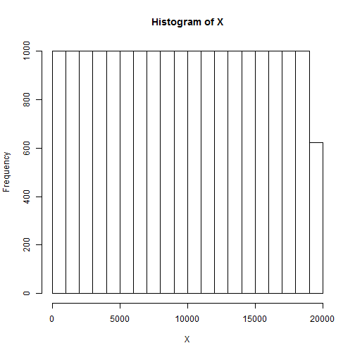
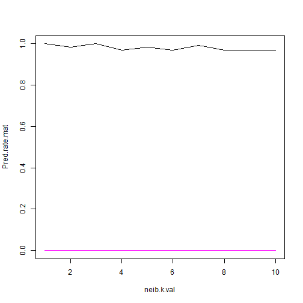

Peer Assessments in Practical Machine Learning
========================================================

I apologize for this totally unfinished report. I was not able to start work on this up until 3 hours before deadline. My algorithm works as follows: 

1. Use only quantitative variables that have non-missing values and "user" variable
2. For each user separately, scale the data, and use nearest neighbor to optimize the number of neighbor (based on CV)
3. Appply this to the testing data.


You can see below my exploratory analysis, but the algorithm testing is not quite finish. I will need to submit the prediction results after the soft deadline.

Sorry.


```r
pml.df  <- read.csv("pml-training.csv", stringsAsFactors = FALSE)
```

You can also embed plots, for example:

#  ```{r fig.width=7, fig.height=6}


```r
dim(pml.df)
```

```
## [1] 19622   160
```

```r
pml.df[1,]
```

```
##   X user_name raw_timestamp_part_1 raw_timestamp_part_2   cvtd_timestamp
## 1 1  carlitos           1323084231               788290 05/12/2011 11:23
##   new_window num_window roll_belt pitch_belt yaw_belt total_accel_belt
## 1         no         11      1.41       8.07    -94.4                3
##   kurtosis_roll_belt kurtosis_picth_belt kurtosis_yaw_belt
## 1                                                         
##   skewness_roll_belt skewness_roll_belt.1 skewness_yaw_belt max_roll_belt
## 1                                                                      NA
##   max_picth_belt max_yaw_belt min_roll_belt min_pitch_belt min_yaw_belt
## 1             NA                         NA             NA             
##   amplitude_roll_belt amplitude_pitch_belt amplitude_yaw_belt
## 1                  NA                   NA                   
##   var_total_accel_belt avg_roll_belt stddev_roll_belt var_roll_belt
## 1                   NA            NA               NA            NA
##   avg_pitch_belt stddev_pitch_belt var_pitch_belt avg_yaw_belt
## 1             NA                NA             NA           NA
##   stddev_yaw_belt var_yaw_belt gyros_belt_x gyros_belt_y gyros_belt_z
## 1              NA           NA            0            0        -0.02
##   accel_belt_x accel_belt_y accel_belt_z magnet_belt_x magnet_belt_y
## 1          -21            4           22            -3           599
##   magnet_belt_z roll_arm pitch_arm yaw_arm total_accel_arm var_accel_arm
## 1          -313     -128      22.5    -161              34            NA
##   avg_roll_arm stddev_roll_arm var_roll_arm avg_pitch_arm stddev_pitch_arm
## 1           NA              NA           NA            NA               NA
##   var_pitch_arm avg_yaw_arm stddev_yaw_arm var_yaw_arm gyros_arm_x
## 1            NA          NA             NA          NA           0
##   gyros_arm_y gyros_arm_z accel_arm_x accel_arm_y accel_arm_z magnet_arm_x
## 1           0       -0.02        -288         109        -123         -368
##   magnet_arm_y magnet_arm_z kurtosis_roll_arm kurtosis_picth_arm
## 1          337          516                                     
##   kurtosis_yaw_arm skewness_roll_arm skewness_pitch_arm skewness_yaw_arm
## 1                                                                       
##   max_roll_arm max_picth_arm max_yaw_arm min_roll_arm min_pitch_arm
## 1           NA            NA          NA           NA            NA
##   min_yaw_arm amplitude_roll_arm amplitude_pitch_arm amplitude_yaw_arm
## 1          NA                 NA                  NA                NA
##   roll_dumbbell pitch_dumbbell yaw_dumbbell kurtosis_roll_dumbbell
## 1         13.05         -70.49       -84.87                       
##   kurtosis_picth_dumbbell kurtosis_yaw_dumbbell skewness_roll_dumbbell
## 1                                                                     
##   skewness_pitch_dumbbell skewness_yaw_dumbbell max_roll_dumbbell
## 1                                                              NA
##   max_picth_dumbbell max_yaw_dumbbell min_roll_dumbbell min_pitch_dumbbell
## 1                 NA                                 NA                 NA
##   min_yaw_dumbbell amplitude_roll_dumbbell amplitude_pitch_dumbbell
## 1                                       NA                       NA
##   amplitude_yaw_dumbbell total_accel_dumbbell var_accel_dumbbell
## 1                                          37                 NA
##   avg_roll_dumbbell stddev_roll_dumbbell var_roll_dumbbell
## 1                NA                   NA                NA
##   avg_pitch_dumbbell stddev_pitch_dumbbell var_pitch_dumbbell
## 1                 NA                    NA                 NA
##   avg_yaw_dumbbell stddev_yaw_dumbbell var_yaw_dumbbell gyros_dumbbell_x
## 1               NA                  NA               NA                0
##   gyros_dumbbell_y gyros_dumbbell_z accel_dumbbell_x accel_dumbbell_y
## 1            -0.02                0             -234               47
##   accel_dumbbell_z magnet_dumbbell_x magnet_dumbbell_y magnet_dumbbell_z
## 1             -271              -559               293               -65
##   roll_forearm pitch_forearm yaw_forearm kurtosis_roll_forearm
## 1         28.4         -63.9        -153                      
##   kurtosis_picth_forearm kurtosis_yaw_forearm skewness_roll_forearm
## 1                                                                  
##   skewness_pitch_forearm skewness_yaw_forearm max_roll_forearm
## 1                                                           NA
##   max_picth_forearm max_yaw_forearm min_roll_forearm min_pitch_forearm
## 1                NA                               NA                NA
##   min_yaw_forearm amplitude_roll_forearm amplitude_pitch_forearm
## 1                                     NA                      NA
##   amplitude_yaw_forearm total_accel_forearm var_accel_forearm
## 1                                        36                NA
##   avg_roll_forearm stddev_roll_forearm var_roll_forearm avg_pitch_forearm
## 1               NA                  NA               NA                NA
##   stddev_pitch_forearm var_pitch_forearm avg_yaw_forearm
## 1                   NA                NA              NA
##   stddev_yaw_forearm var_yaw_forearm gyros_forearm_x gyros_forearm_y
## 1                 NA              NA            0.03               0
##   gyros_forearm_z accel_forearm_x accel_forearm_y accel_forearm_z
## 1           -0.02             192             203            -215
##   magnet_forearm_x magnet_forearm_y magnet_forearm_z classe
## 1              -17              654              476      A
```

```r
str(pml.df)
```

```
## 'data.frame':	19622 obs. of  160 variables:
##  $ X                       : int  1 2 3 4 5 6 7 8 9 10 ...
##  $ user_name               : chr  "carlitos" "carlitos" "carlitos" "carlitos" ...
##  $ raw_timestamp_part_1    : int  1323084231 1323084231 1323084231 1323084232 1323084232 1323084232 1323084232 1323084232 1323084232 1323084232 ...
##  $ raw_timestamp_part_2    : int  788290 808298 820366 120339 196328 304277 368296 440390 484323 484434 ...
##  $ cvtd_timestamp          : chr  "05/12/2011 11:23" "05/12/2011 11:23" "05/12/2011 11:23" "05/12/2011 11:23" ...
##  $ new_window              : chr  "no" "no" "no" "no" ...
##  $ num_window              : int  11 11 11 12 12 12 12 12 12 12 ...
##  $ roll_belt               : num  1.41 1.41 1.42 1.48 1.48 1.45 1.42 1.42 1.43 1.45 ...
##  $ pitch_belt              : num  8.07 8.07 8.07 8.05 8.07 8.06 8.09 8.13 8.16 8.17 ...
##  $ yaw_belt                : num  -94.4 -94.4 -94.4 -94.4 -94.4 -94.4 -94.4 -94.4 -94.4 -94.4 ...
##  $ total_accel_belt        : int  3 3 3 3 3 3 3 3 3 3 ...
##  $ kurtosis_roll_belt      : chr  "" "" "" "" ...
##  $ kurtosis_picth_belt     : chr  "" "" "" "" ...
##  $ kurtosis_yaw_belt       : chr  "" "" "" "" ...
##  $ skewness_roll_belt      : chr  "" "" "" "" ...
##  $ skewness_roll_belt.1    : chr  "" "" "" "" ...
##  $ skewness_yaw_belt       : chr  "" "" "" "" ...
##  $ max_roll_belt           : num  NA NA NA NA NA NA NA NA NA NA ...
##  $ max_picth_belt          : int  NA NA NA NA NA NA NA NA NA NA ...
##  $ max_yaw_belt            : chr  "" "" "" "" ...
##  $ min_roll_belt           : num  NA NA NA NA NA NA NA NA NA NA ...
##  $ min_pitch_belt          : int  NA NA NA NA NA NA NA NA NA NA ...
##  $ min_yaw_belt            : chr  "" "" "" "" ...
##  $ amplitude_roll_belt     : num  NA NA NA NA NA NA NA NA NA NA ...
##  $ amplitude_pitch_belt    : int  NA NA NA NA NA NA NA NA NA NA ...
##  $ amplitude_yaw_belt      : chr  "" "" "" "" ...
##  $ var_total_accel_belt    : num  NA NA NA NA NA NA NA NA NA NA ...
##  $ avg_roll_belt           : num  NA NA NA NA NA NA NA NA NA NA ...
##  $ stddev_roll_belt        : num  NA NA NA NA NA NA NA NA NA NA ...
##  $ var_roll_belt           : num  NA NA NA NA NA NA NA NA NA NA ...
##  $ avg_pitch_belt          : num  NA NA NA NA NA NA NA NA NA NA ...
##  $ stddev_pitch_belt       : num  NA NA NA NA NA NA NA NA NA NA ...
##  $ var_pitch_belt          : num  NA NA NA NA NA NA NA NA NA NA ...
##  $ avg_yaw_belt            : num  NA NA NA NA NA NA NA NA NA NA ...
##  $ stddev_yaw_belt         : num  NA NA NA NA NA NA NA NA NA NA ...
##  $ var_yaw_belt            : num  NA NA NA NA NA NA NA NA NA NA ...
##  $ gyros_belt_x            : num  0 0.02 0 0.02 0.02 0.02 0.02 0.02 0.02 0.03 ...
##  $ gyros_belt_y            : num  0 0 0 0 0.02 0 0 0 0 0 ...
##  $ gyros_belt_z            : num  -0.02 -0.02 -0.02 -0.03 -0.02 -0.02 -0.02 -0.02 -0.02 0 ...
##  $ accel_belt_x            : int  -21 -22 -20 -22 -21 -21 -22 -22 -20 -21 ...
##  $ accel_belt_y            : int  4 4 5 3 2 4 3 4 2 4 ...
##  $ accel_belt_z            : int  22 22 23 21 24 21 21 21 24 22 ...
##  $ magnet_belt_x           : int  -3 -7 -2 -6 -6 0 -4 -2 1 -3 ...
##  $ magnet_belt_y           : int  599 608 600 604 600 603 599 603 602 609 ...
##  $ magnet_belt_z           : int  -313 -311 -305 -310 -302 -312 -311 -313 -312 -308 ...
##  $ roll_arm                : num  -128 -128 -128 -128 -128 -128 -128 -128 -128 -128 ...
##  $ pitch_arm               : num  22.5 22.5 22.5 22.1 22.1 22 21.9 21.8 21.7 21.6 ...
##  $ yaw_arm                 : num  -161 -161 -161 -161 -161 -161 -161 -161 -161 -161 ...
##  $ total_accel_arm         : int  34 34 34 34 34 34 34 34 34 34 ...
##  $ var_accel_arm           : num  NA NA NA NA NA NA NA NA NA NA ...
##  $ avg_roll_arm            : num  NA NA NA NA NA NA NA NA NA NA ...
##  $ stddev_roll_arm         : num  NA NA NA NA NA NA NA NA NA NA ...
##  $ var_roll_arm            : num  NA NA NA NA NA NA NA NA NA NA ...
##  $ avg_pitch_arm           : num  NA NA NA NA NA NA NA NA NA NA ...
##  $ stddev_pitch_arm        : num  NA NA NA NA NA NA NA NA NA NA ...
##  $ var_pitch_arm           : num  NA NA NA NA NA NA NA NA NA NA ...
##  $ avg_yaw_arm             : num  NA NA NA NA NA NA NA NA NA NA ...
##  $ stddev_yaw_arm          : num  NA NA NA NA NA NA NA NA NA NA ...
##  $ var_yaw_arm             : num  NA NA NA NA NA NA NA NA NA NA ...
##  $ gyros_arm_x             : num  0 0.02 0.02 0.02 0 0.02 0 0.02 0.02 0.02 ...
##  $ gyros_arm_y             : num  0 -0.02 -0.02 -0.03 -0.03 -0.03 -0.03 -0.02 -0.03 -0.03 ...
##  $ gyros_arm_z             : num  -0.02 -0.02 -0.02 0.02 0 0 0 0 -0.02 -0.02 ...
##  $ accel_arm_x             : int  -288 -290 -289 -289 -289 -289 -289 -289 -288 -288 ...
##  $ accel_arm_y             : int  109 110 110 111 111 111 111 111 109 110 ...
##  $ accel_arm_z             : int  -123 -125 -126 -123 -123 -122 -125 -124 -122 -124 ...
##  $ magnet_arm_x            : int  -368 -369 -368 -372 -374 -369 -373 -372 -369 -376 ...
##  $ magnet_arm_y            : int  337 337 344 344 337 342 336 338 341 334 ...
##  $ magnet_arm_z            : int  516 513 513 512 506 513 509 510 518 516 ...
##  $ kurtosis_roll_arm       : chr  "" "" "" "" ...
##  $ kurtosis_picth_arm      : chr  "" "" "" "" ...
##  $ kurtosis_yaw_arm        : chr  "" "" "" "" ...
##  $ skewness_roll_arm       : chr  "" "" "" "" ...
##  $ skewness_pitch_arm      : chr  "" "" "" "" ...
##  $ skewness_yaw_arm        : chr  "" "" "" "" ...
##  $ max_roll_arm            : num  NA NA NA NA NA NA NA NA NA NA ...
##  $ max_picth_arm           : num  NA NA NA NA NA NA NA NA NA NA ...
##  $ max_yaw_arm             : int  NA NA NA NA NA NA NA NA NA NA ...
##  $ min_roll_arm            : num  NA NA NA NA NA NA NA NA NA NA ...
##  $ min_pitch_arm           : num  NA NA NA NA NA NA NA NA NA NA ...
##  $ min_yaw_arm             : int  NA NA NA NA NA NA NA NA NA NA ...
##  $ amplitude_roll_arm      : num  NA NA NA NA NA NA NA NA NA NA ...
##  $ amplitude_pitch_arm     : num  NA NA NA NA NA NA NA NA NA NA ...
##  $ amplitude_yaw_arm       : int  NA NA NA NA NA NA NA NA NA NA ...
##  $ roll_dumbbell           : num  13.1 13.1 12.9 13.4 13.4 ...
##  $ pitch_dumbbell          : num  -70.5 -70.6 -70.3 -70.4 -70.4 ...
##  $ yaw_dumbbell            : num  -84.9 -84.7 -85.1 -84.9 -84.9 ...
##  $ kurtosis_roll_dumbbell  : chr  "" "" "" "" ...
##  $ kurtosis_picth_dumbbell : chr  "" "" "" "" ...
##  $ kurtosis_yaw_dumbbell   : chr  "" "" "" "" ...
##  $ skewness_roll_dumbbell  : chr  "" "" "" "" ...
##  $ skewness_pitch_dumbbell : chr  "" "" "" "" ...
##  $ skewness_yaw_dumbbell   : chr  "" "" "" "" ...
##  $ max_roll_dumbbell       : num  NA NA NA NA NA NA NA NA NA NA ...
##  $ max_picth_dumbbell      : num  NA NA NA NA NA NA NA NA NA NA ...
##  $ max_yaw_dumbbell        : chr  "" "" "" "" ...
##  $ min_roll_dumbbell       : num  NA NA NA NA NA NA NA NA NA NA ...
##  $ min_pitch_dumbbell      : num  NA NA NA NA NA NA NA NA NA NA ...
##  $ min_yaw_dumbbell        : chr  "" "" "" "" ...
##  $ amplitude_roll_dumbbell : num  NA NA NA NA NA NA NA NA NA NA ...
##   [list output truncated]
```


```r
attach(pml.df)
hist(X)
```

 

```r
table(user_name)
```

```
## user_name
##   adelmo carlitos  charles   eurico   jeremy    pedro 
##     3892     3112     3536     3070     3402     2610
```


```r
CountNA <- function(x) sum(is.na(x))
apply(pml.df,2,CountNA)
```

```
##                        X                user_name     raw_timestamp_part_1 
##                        0                        0                        0 
##     raw_timestamp_part_2           cvtd_timestamp               new_window 
##                        0                        0                        0 
##               num_window                roll_belt               pitch_belt 
##                        0                        0                        0 
##                 yaw_belt         total_accel_belt       kurtosis_roll_belt 
##                        0                        0                        0 
##      kurtosis_picth_belt        kurtosis_yaw_belt       skewness_roll_belt 
##                        0                        0                        0 
##     skewness_roll_belt.1        skewness_yaw_belt            max_roll_belt 
##                        0                        0                    19216 
##           max_picth_belt             max_yaw_belt            min_roll_belt 
##                    19216                        0                    19216 
##           min_pitch_belt             min_yaw_belt      amplitude_roll_belt 
##                    19216                        0                    19216 
##     amplitude_pitch_belt       amplitude_yaw_belt     var_total_accel_belt 
##                    19216                        0                    19216 
##            avg_roll_belt         stddev_roll_belt            var_roll_belt 
##                    19216                    19216                    19216 
##           avg_pitch_belt        stddev_pitch_belt           var_pitch_belt 
##                    19216                    19216                    19216 
##             avg_yaw_belt          stddev_yaw_belt             var_yaw_belt 
##                    19216                    19216                    19216 
##             gyros_belt_x             gyros_belt_y             gyros_belt_z 
##                        0                        0                        0 
##             accel_belt_x             accel_belt_y             accel_belt_z 
##                        0                        0                        0 
##            magnet_belt_x            magnet_belt_y            magnet_belt_z 
##                        0                        0                        0 
##                 roll_arm                pitch_arm                  yaw_arm 
##                        0                        0                        0 
##          total_accel_arm            var_accel_arm             avg_roll_arm 
##                        0                    19216                    19216 
##          stddev_roll_arm             var_roll_arm            avg_pitch_arm 
##                    19216                    19216                    19216 
##         stddev_pitch_arm            var_pitch_arm              avg_yaw_arm 
##                    19216                    19216                    19216 
##           stddev_yaw_arm              var_yaw_arm              gyros_arm_x 
##                    19216                    19216                        0 
##              gyros_arm_y              gyros_arm_z              accel_arm_x 
##                        0                        0                        0 
##              accel_arm_y              accel_arm_z             magnet_arm_x 
##                        0                        0                        0 
##             magnet_arm_y             magnet_arm_z        kurtosis_roll_arm 
##                        0                        0                        0 
##       kurtosis_picth_arm         kurtosis_yaw_arm        skewness_roll_arm 
##                        0                        0                        0 
##       skewness_pitch_arm         skewness_yaw_arm             max_roll_arm 
##                        0                        0                    19216 
##            max_picth_arm              max_yaw_arm             min_roll_arm 
##                    19216                    19216                    19216 
##            min_pitch_arm              min_yaw_arm       amplitude_roll_arm 
##                    19216                    19216                    19216 
##      amplitude_pitch_arm        amplitude_yaw_arm            roll_dumbbell 
##                    19216                    19216                        0 
##           pitch_dumbbell             yaw_dumbbell   kurtosis_roll_dumbbell 
##                        0                        0                        0 
##  kurtosis_picth_dumbbell    kurtosis_yaw_dumbbell   skewness_roll_dumbbell 
##                        0                        0                        0 
##  skewness_pitch_dumbbell    skewness_yaw_dumbbell        max_roll_dumbbell 
##                        0                        0                    19216 
##       max_picth_dumbbell         max_yaw_dumbbell        min_roll_dumbbell 
##                    19216                        0                    19216 
##       min_pitch_dumbbell         min_yaw_dumbbell  amplitude_roll_dumbbell 
##                    19216                        0                    19216 
## amplitude_pitch_dumbbell   amplitude_yaw_dumbbell     total_accel_dumbbell 
##                    19216                        0                        0 
##       var_accel_dumbbell        avg_roll_dumbbell     stddev_roll_dumbbell 
##                    19216                    19216                    19216 
##        var_roll_dumbbell       avg_pitch_dumbbell    stddev_pitch_dumbbell 
##                    19216                    19216                    19216 
##       var_pitch_dumbbell         avg_yaw_dumbbell      stddev_yaw_dumbbell 
##                    19216                    19216                    19216 
##         var_yaw_dumbbell         gyros_dumbbell_x         gyros_dumbbell_y 
##                    19216                        0                        0 
##         gyros_dumbbell_z         accel_dumbbell_x         accel_dumbbell_y 
##                        0                        0                        0 
##         accel_dumbbell_z        magnet_dumbbell_x        magnet_dumbbell_y 
##                        0                        0                        0 
##        magnet_dumbbell_z             roll_forearm            pitch_forearm 
##                        0                        0                        0 
##              yaw_forearm    kurtosis_roll_forearm   kurtosis_picth_forearm 
##                        0                        0                        0 
##     kurtosis_yaw_forearm    skewness_roll_forearm   skewness_pitch_forearm 
##                        0                        0                        0 
##     skewness_yaw_forearm         max_roll_forearm        max_picth_forearm 
##                        0                    19216                    19216 
##          max_yaw_forearm         min_roll_forearm        min_pitch_forearm 
##                        0                    19216                    19216 
##          min_yaw_forearm   amplitude_roll_forearm  amplitude_pitch_forearm 
##                        0                    19216                    19216 
##    amplitude_yaw_forearm      total_accel_forearm        var_accel_forearm 
##                        0                        0                    19216 
##         avg_roll_forearm      stddev_roll_forearm         var_roll_forearm 
##                    19216                    19216                    19216 
##        avg_pitch_forearm     stddev_pitch_forearm        var_pitch_forearm 
##                    19216                    19216                    19216 
##          avg_yaw_forearm       stddev_yaw_forearm          var_yaw_forearm 
##                    19216                    19216                    19216 
##          gyros_forearm_x          gyros_forearm_y          gyros_forearm_z 
##                        0                        0                        0 
##          accel_forearm_x          accel_forearm_y          accel_forearm_z 
##                        0                        0                        0 
##         magnet_forearm_x         magnet_forearm_y         magnet_forearm_z 
##                        0                        0                        0 
##                   classe 
##                        0
```


```r
pml.test.df  <- read.csv("pml-testing.csv", stringsAsFactors = FALSE)
Count.v <- apply(pml.test.df,2,CountNA)
dim(pml.test.df)
```

```
## [1]  20 160
```

```r
Cond <- ((Count.v>0)|(c(T,F,rep(T,5),rep(F,153))))
pml.df2 <- pml.df[,!Cond]
str(pml.df2)
```

```
## 'data.frame':	19622 obs. of  54 variables:
##  $ user_name           : chr  "carlitos" "carlitos" "carlitos" "carlitos" ...
##  $ roll_belt           : num  1.41 1.41 1.42 1.48 1.48 1.45 1.42 1.42 1.43 1.45 ...
##  $ pitch_belt          : num  8.07 8.07 8.07 8.05 8.07 8.06 8.09 8.13 8.16 8.17 ...
##  $ yaw_belt            : num  -94.4 -94.4 -94.4 -94.4 -94.4 -94.4 -94.4 -94.4 -94.4 -94.4 ...
##  $ total_accel_belt    : int  3 3 3 3 3 3 3 3 3 3 ...
##  $ gyros_belt_x        : num  0 0.02 0 0.02 0.02 0.02 0.02 0.02 0.02 0.03 ...
##  $ gyros_belt_y        : num  0 0 0 0 0.02 0 0 0 0 0 ...
##  $ gyros_belt_z        : num  -0.02 -0.02 -0.02 -0.03 -0.02 -0.02 -0.02 -0.02 -0.02 0 ...
##  $ accel_belt_x        : int  -21 -22 -20 -22 -21 -21 -22 -22 -20 -21 ...
##  $ accel_belt_y        : int  4 4 5 3 2 4 3 4 2 4 ...
##  $ accel_belt_z        : int  22 22 23 21 24 21 21 21 24 22 ...
##  $ magnet_belt_x       : int  -3 -7 -2 -6 -6 0 -4 -2 1 -3 ...
##  $ magnet_belt_y       : int  599 608 600 604 600 603 599 603 602 609 ...
##  $ magnet_belt_z       : int  -313 -311 -305 -310 -302 -312 -311 -313 -312 -308 ...
##  $ roll_arm            : num  -128 -128 -128 -128 -128 -128 -128 -128 -128 -128 ...
##  $ pitch_arm           : num  22.5 22.5 22.5 22.1 22.1 22 21.9 21.8 21.7 21.6 ...
##  $ yaw_arm             : num  -161 -161 -161 -161 -161 -161 -161 -161 -161 -161 ...
##  $ total_accel_arm     : int  34 34 34 34 34 34 34 34 34 34 ...
##  $ gyros_arm_x         : num  0 0.02 0.02 0.02 0 0.02 0 0.02 0.02 0.02 ...
##  $ gyros_arm_y         : num  0 -0.02 -0.02 -0.03 -0.03 -0.03 -0.03 -0.02 -0.03 -0.03 ...
##  $ gyros_arm_z         : num  -0.02 -0.02 -0.02 0.02 0 0 0 0 -0.02 -0.02 ...
##  $ accel_arm_x         : int  -288 -290 -289 -289 -289 -289 -289 -289 -288 -288 ...
##  $ accel_arm_y         : int  109 110 110 111 111 111 111 111 109 110 ...
##  $ accel_arm_z         : int  -123 -125 -126 -123 -123 -122 -125 -124 -122 -124 ...
##  $ magnet_arm_x        : int  -368 -369 -368 -372 -374 -369 -373 -372 -369 -376 ...
##  $ magnet_arm_y        : int  337 337 344 344 337 342 336 338 341 334 ...
##  $ magnet_arm_z        : int  516 513 513 512 506 513 509 510 518 516 ...
##  $ roll_dumbbell       : num  13.1 13.1 12.9 13.4 13.4 ...
##  $ pitch_dumbbell      : num  -70.5 -70.6 -70.3 -70.4 -70.4 ...
##  $ yaw_dumbbell        : num  -84.9 -84.7 -85.1 -84.9 -84.9 ...
##  $ total_accel_dumbbell: int  37 37 37 37 37 37 37 37 37 37 ...
##  $ gyros_dumbbell_x    : num  0 0 0 0 0 0 0 0 0 0 ...
##  $ gyros_dumbbell_y    : num  -0.02 -0.02 -0.02 -0.02 -0.02 -0.02 -0.02 -0.02 -0.02 -0.02 ...
##  $ gyros_dumbbell_z    : num  0 0 0 -0.02 0 0 0 0 0 0 ...
##  $ accel_dumbbell_x    : int  -234 -233 -232 -232 -233 -234 -232 -234 -232 -235 ...
##  $ accel_dumbbell_y    : int  47 47 46 48 48 48 47 46 47 48 ...
##  $ accel_dumbbell_z    : int  -271 -269 -270 -269 -270 -269 -270 -272 -269 -270 ...
##  $ magnet_dumbbell_x   : int  -559 -555 -561 -552 -554 -558 -551 -555 -549 -558 ...
##  $ magnet_dumbbell_y   : int  293 296 298 303 292 294 295 300 292 291 ...
##  $ magnet_dumbbell_z   : num  -65 -64 -63 -60 -68 -66 -70 -74 -65 -69 ...
##  $ roll_forearm        : num  28.4 28.3 28.3 28.1 28 27.9 27.9 27.8 27.7 27.7 ...
##  $ pitch_forearm       : num  -63.9 -63.9 -63.9 -63.9 -63.9 -63.9 -63.9 -63.8 -63.8 -63.8 ...
##  $ yaw_forearm         : num  -153 -153 -152 -152 -152 -152 -152 -152 -152 -152 ...
##  $ total_accel_forearm : int  36 36 36 36 36 36 36 36 36 36 ...
##  $ gyros_forearm_x     : num  0.03 0.02 0.03 0.02 0.02 0.02 0.02 0.02 0.03 0.02 ...
##  $ gyros_forearm_y     : num  0 0 -0.02 -0.02 0 -0.02 0 -0.02 0 0 ...
##  $ gyros_forearm_z     : num  -0.02 -0.02 0 0 -0.02 -0.03 -0.02 0 -0.02 -0.02 ...
##  $ accel_forearm_x     : int  192 192 196 189 189 193 195 193 193 190 ...
##  $ accel_forearm_y     : int  203 203 204 206 206 203 205 205 204 205 ...
##  $ accel_forearm_z     : int  -215 -216 -213 -214 -214 -215 -215 -213 -214 -215 ...
##  $ magnet_forearm_x    : int  -17 -18 -18 -16 -17 -9 -18 -9 -16 -22 ...
##  $ magnet_forearm_y    : num  654 661 658 658 655 660 659 660 653 656 ...
##  $ magnet_forearm_z    : num  476 473 469 469 473 478 470 474 476 473 ...
##  $ classe              : chr  "A" "A" "A" "A" ...
```

```r
apply(pml.df2,2,CountNA)
```

```
##            user_name            roll_belt           pitch_belt 
##                    0                    0                    0 
##             yaw_belt     total_accel_belt         gyros_belt_x 
##                    0                    0                    0 
##         gyros_belt_y         gyros_belt_z         accel_belt_x 
##                    0                    0                    0 
##         accel_belt_y         accel_belt_z        magnet_belt_x 
##                    0                    0                    0 
##        magnet_belt_y        magnet_belt_z             roll_arm 
##                    0                    0                    0 
##            pitch_arm              yaw_arm      total_accel_arm 
##                    0                    0                    0 
##          gyros_arm_x          gyros_arm_y          gyros_arm_z 
##                    0                    0                    0 
##          accel_arm_x          accel_arm_y          accel_arm_z 
##                    0                    0                    0 
##         magnet_arm_x         magnet_arm_y         magnet_arm_z 
##                    0                    0                    0 
##        roll_dumbbell       pitch_dumbbell         yaw_dumbbell 
##                    0                    0                    0 
## total_accel_dumbbell     gyros_dumbbell_x     gyros_dumbbell_y 
##                    0                    0                    0 
##     gyros_dumbbell_z     accel_dumbbell_x     accel_dumbbell_y 
##                    0                    0                    0 
##     accel_dumbbell_z    magnet_dumbbell_x    magnet_dumbbell_y 
##                    0                    0                    0 
##    magnet_dumbbell_z         roll_forearm        pitch_forearm 
##                    0                    0                    0 
##          yaw_forearm  total_accel_forearm      gyros_forearm_x 
##                    0                    0                    0 
##      gyros_forearm_y      gyros_forearm_z      accel_forearm_x 
##                    0                    0                    0 
##      accel_forearm_y      accel_forearm_z     magnet_forearm_x 
##                    0                    0                    0 
##     magnet_forearm_y     magnet_forearm_z               classe 
##                    0                    0                    0
```


```r
require(class)
```

```
## Loading required package: class
```

```r
set.seed(10)
```


```r
k  <-  ncol(pml.df2)
k
```

```
## [1] 54
```

```r
Predict.f <- function(Test.p=0.1,neib.k=10,User="Name") {
   Cond.User <- (pml.df2[,1]==User)
   mat <- pml.df2[Cond.User,]
   Y  <-  as.factor(mat[,k])
   X.mat <- mat[,-c(1,k)]
   X.mat <- scale(X.mat) # should really scale training and then testing the same way, but have not time now 
   n <- nrow(mat)
   Ind <- sample(1:n,floor(n*Test.p))
   train <- X.mat[-Ind,]
   cl <- Y[-Ind]
   test <- X.mat[Ind,]
   Y.pred <- knn(train, test, cl, k = neib.k, l = 0, prob = FALSE, use.all = TRUE)
   Pred.rate <- sum(Y.pred==Y[Ind])/length(Ind)
   Pred.rate
   
}
Predict.f(Test.p=0.1,neib.k=10,User="carlitos")
```

```
## [1] 0.9678
```


```r
pml.test.df2 <- pml.test.df[,!Cond]
str(pml.test.df2)
```

```
## 'data.frame':	20 obs. of  54 variables:
##  $ user_name           : chr  "pedro" "jeremy" "jeremy" "adelmo" ...
##  $ roll_belt           : num  123 1.02 0.87 125 1.35 -5.92 1.2 0.43 0.93 114 ...
##  $ pitch_belt          : num  27 4.87 1.82 -41.6 3.33 1.59 4.44 4.15 6.72 22.4 ...
##  $ yaw_belt            : num  -4.75 -88.9 -88.5 162 -88.6 -87.7 -87.3 -88.5 -93.7 -13.1 ...
##  $ total_accel_belt    : int  20 4 5 17 3 4 4 4 4 18 ...
##  $ gyros_belt_x        : num  -0.5 -0.06 0.05 0.11 0.03 0.1 -0.06 -0.18 0.1 0.14 ...
##  $ gyros_belt_y        : num  -0.02 -0.02 0.02 0.11 0.02 0.05 0 -0.02 0 0.11 ...
##  $ gyros_belt_z        : num  -0.46 -0.07 0.03 -0.16 0 -0.13 0 -0.03 -0.02 -0.16 ...
##  $ accel_belt_x        : int  -38 -13 1 46 -8 -11 -14 -10 -15 -25 ...
##  $ accel_belt_y        : int  69 11 -1 45 4 -16 2 -2 1 63 ...
##  $ accel_belt_z        : int  -179 39 49 -156 27 38 35 42 32 -158 ...
##  $ magnet_belt_x       : int  -13 43 29 169 33 31 50 39 -6 10 ...
##  $ magnet_belt_y       : int  581 636 631 608 566 638 622 635 600 601 ...
##  $ magnet_belt_z       : int  -382 -309 -312 -304 -418 -291 -315 -305 -302 -330 ...
##  $ roll_arm            : num  40.7 0 0 -109 76.1 0 0 0 -137 -82.4 ...
##  $ pitch_arm           : num  -27.8 0 0 55 2.76 0 0 0 11.2 -63.8 ...
##  $ yaw_arm             : num  178 0 0 -142 102 0 0 0 -167 -75.3 ...
##  $ total_accel_arm     : int  10 38 44 25 29 14 15 22 34 32 ...
##  $ gyros_arm_x         : num  -1.65 -1.17 2.1 0.22 -1.96 0.02 2.36 -3.71 0.03 0.26 ...
##  $ gyros_arm_y         : num  0.48 0.85 -1.36 -0.51 0.79 0.05 -1.01 1.85 -0.02 -0.5 ...
##  $ gyros_arm_z         : num  -0.18 -0.43 1.13 0.92 -0.54 -0.07 0.89 -0.69 -0.02 0.79 ...
##  $ accel_arm_x         : int  16 -290 -341 -238 -197 -26 99 -98 -287 -301 ...
##  $ accel_arm_y         : int  38 215 245 -57 200 130 79 175 111 -42 ...
##  $ accel_arm_z         : int  93 -90 -87 6 -30 -19 -67 -78 -122 -80 ...
##  $ magnet_arm_x        : int  -326 -325 -264 -173 -170 396 702 535 -367 -420 ...
##  $ magnet_arm_y        : int  385 447 474 257 275 176 15 215 335 294 ...
##  $ magnet_arm_z        : int  481 434 413 633 617 516 217 385 520 493 ...
##  $ roll_dumbbell       : num  -17.7 54.5 57.1 43.1 -101.4 ...
##  $ pitch_dumbbell      : num  25 -53.7 -51.4 -30 -53.4 ...
##  $ yaw_dumbbell        : num  126.2 -75.5 -75.2 -103.3 -14.2 ...
##  $ total_accel_dumbbell: int  9 31 29 18 4 29 29 29 3 2 ...
##  $ gyros_dumbbell_x    : num  0.64 0.34 0.39 0.1 0.29 -0.59 0.34 0.37 0.03 0.42 ...
##  $ gyros_dumbbell_y    : num  0.06 0.05 0.14 -0.02 -0.47 0.8 0.16 0.14 -0.21 0.51 ...
##  $ gyros_dumbbell_z    : num  -0.61 -0.71 -0.34 0.05 -0.46 1.1 -0.23 -0.39 -0.21 -0.03 ...
##  $ accel_dumbbell_x    : int  21 -153 -141 -51 -18 -138 -145 -140 0 -7 ...
##  $ accel_dumbbell_y    : int  -15 155 155 72 -30 166 150 159 25 -20 ...
##  $ accel_dumbbell_z    : int  81 -205 -196 -148 -5 -186 -190 -191 9 7 ...
##  $ magnet_dumbbell_x   : int  523 -502 -506 -576 -424 -543 -484 -515 -519 -531 ...
##  $ magnet_dumbbell_y   : int  -528 388 349 238 252 262 354 350 348 321 ...
##  $ magnet_dumbbell_z   : int  -56 -36 41 53 312 96 97 53 -32 -164 ...
##  $ roll_forearm        : num  141 109 131 0 -176 150 155 -161 15.5 13.2 ...
##  $ pitch_forearm       : num  49.3 -17.6 -32.6 0 -2.16 1.46 34.5 43.6 -63.5 19.4 ...
##  $ yaw_forearm         : num  156 106 93 0 -47.9 89.7 152 -89.5 -139 -105 ...
##  $ total_accel_forearm : int  33 39 34 43 24 43 32 47 36 24 ...
##  $ gyros_forearm_x     : num  0.74 1.12 0.18 1.38 -0.75 -0.88 -0.53 0.63 0.03 0.02 ...
##  $ gyros_forearm_y     : num  -3.34 -2.78 -0.79 0.69 3.1 4.26 1.8 -0.74 0.02 0.13 ...
##  $ gyros_forearm_z     : num  -0.59 -0.18 0.28 1.8 0.8 1.35 0.75 0.49 -0.02 -0.07 ...
##  $ accel_forearm_x     : int  -110 212 154 -92 131 230 -192 -151 195 -212 ...
##  $ accel_forearm_y     : int  267 297 271 406 -93 322 170 -331 204 98 ...
##  $ accel_forearm_z     : int  -149 -118 -129 -39 172 -144 -175 -282 -217 -7 ...
##  $ magnet_forearm_x    : int  -714 -237 -51 -233 375 -300 -678 -109 0 -403 ...
##  $ magnet_forearm_y    : int  419 791 698 783 -787 800 284 -619 652 723 ...
##  $ magnet_forearm_z    : int  617 873 783 521 91 884 585 -32 469 512 ...
##  $ problem_id          : int  1 2 3 4 5 6 7 8 9 10 ...
```

```r
apply(pml.test.df2,2,CountNA)
```

```
##            user_name            roll_belt           pitch_belt 
##                    0                    0                    0 
##             yaw_belt     total_accel_belt         gyros_belt_x 
##                    0                    0                    0 
##         gyros_belt_y         gyros_belt_z         accel_belt_x 
##                    0                    0                    0 
##         accel_belt_y         accel_belt_z        magnet_belt_x 
##                    0                    0                    0 
##        magnet_belt_y        magnet_belt_z             roll_arm 
##                    0                    0                    0 
##            pitch_arm              yaw_arm      total_accel_arm 
##                    0                    0                    0 
##          gyros_arm_x          gyros_arm_y          gyros_arm_z 
##                    0                    0                    0 
##          accel_arm_x          accel_arm_y          accel_arm_z 
##                    0                    0                    0 
##         magnet_arm_x         magnet_arm_y         magnet_arm_z 
##                    0                    0                    0 
##        roll_dumbbell       pitch_dumbbell         yaw_dumbbell 
##                    0                    0                    0 
## total_accel_dumbbell     gyros_dumbbell_x     gyros_dumbbell_y 
##                    0                    0                    0 
##     gyros_dumbbell_z     accel_dumbbell_x     accel_dumbbell_y 
##                    0                    0                    0 
##     accel_dumbbell_z    magnet_dumbbell_x    magnet_dumbbell_y 
##                    0                    0                    0 
##    magnet_dumbbell_z         roll_forearm        pitch_forearm 
##                    0                    0                    0 
##          yaw_forearm  total_accel_forearm      gyros_forearm_x 
##                    0                    0                    0 
##      gyros_forearm_y      gyros_forearm_z      accel_forearm_x 
##                    0                    0                    0 
##      accel_forearm_y      accel_forearm_z     magnet_forearm_x 
##                    0                    0                    0 
##     magnet_forearm_y     magnet_forearm_z           problem_id 
##                    0                    0                    0
```

```r
dim(pml.test.df2)
```

```
## [1] 20 54
```

```r
Users.v <- unique(pml.test.df2[,1])
Users.v
```

```
## [1] "pedro"    "jeremy"   "adelmo"   "eurico"   "carlitos" "charles"
```


```r
Test.p.val <- 0.1
neib.k.val <- c(1:10)
d <- length(neib.k.val)
m <- length(Users.v)
m
```

```
## [1] 6
```

```r
Pred.rate.mat <- matrix(0,d,m)
for (h in 1:m){
   print(h)
   for (j in 1:d) {
      print(h)
      # browser()
      Pred.rate.mat[j,h] <- Predict.f(Test.p=Test.p.val, neib.k=neib.k.val[j], User=Users.v[h])
   }
}
```

```
## [1] 1
## [1] 1
## [1] 1
## [1] 1
## [1] 1
## [1] 1
## [1] 1
## [1] 1
## [1] 1
## [1] 1
## [1] 1
## [1] 2
## [1] 2
```

```
## Error: no missing values are allowed
```

```r
Pred.rate.mat
```

```
##         [,1] [,2] [,3] [,4] [,5] [,6]
##  [1,] 1.0000    0    0    0    0    0
##  [2,] 0.9847    0    0    0    0    0
##  [3,] 1.0000    0    0    0    0    0
##  [4,] 0.9693    0    0    0    0    0
##  [5,] 0.9847    0    0    0    0    0
##  [6,] 0.9693    0    0    0    0    0
##  [7,] 0.9923    0    0    0    0    0
##  [8,] 0.9693    0    0    0    0    0
##  [9,] 0.9655    0    0    0    0    0
## [10,] 0.9693    0    0    0    0    0
```

```r
matplot(neib.k.val,Pred.rate.mat,type="l")
```

 
   

Please, cite this paper to refer the WLE dataset

Velloso, E.; Bulling, A.; Gellersen, H.; Ugulino, W.; Fuks, H. Qualitative Activity Recognition of Weight Lifting Exercises. Proceedings of 4th International Conference in Cooperation with SIGCHI (Augmented Human '13) . Stuttgart, Germany: ACM SIGCHI, 2013.


